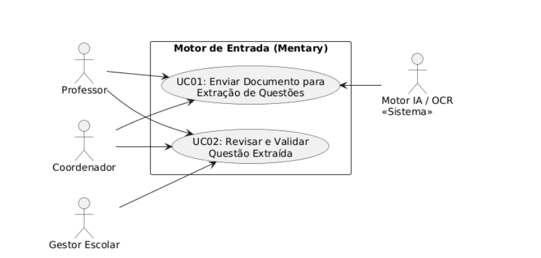
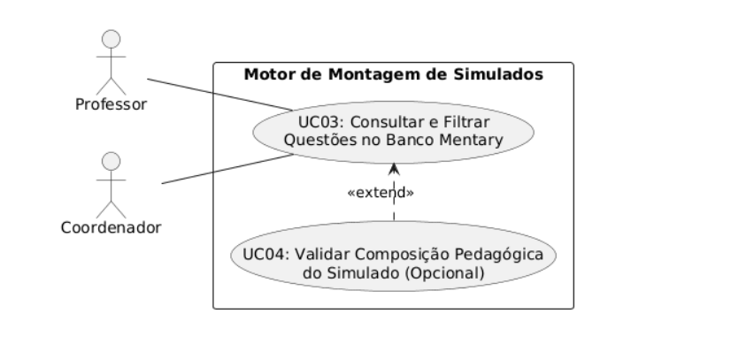
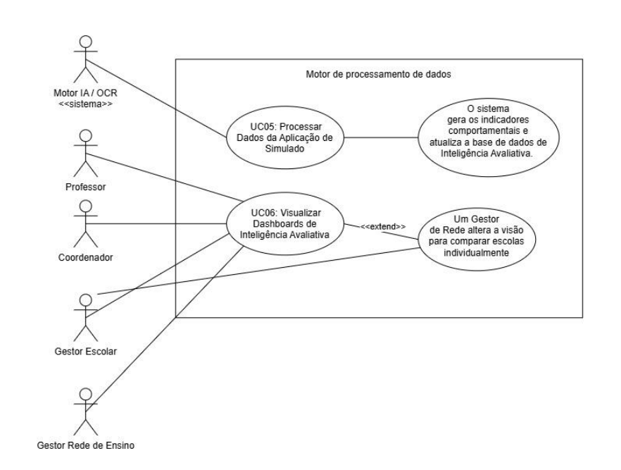
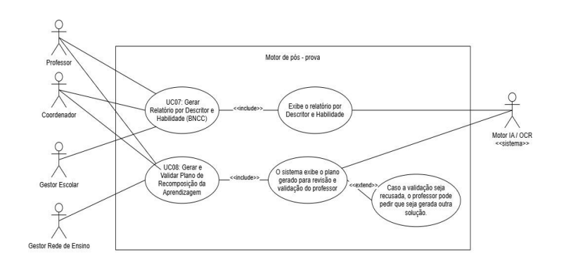

# 📄 Especificação de Casos de Uso - Sistema Mentary

## 1. Motor de Entrada (Mentary)

### UC01: Enviar Documento para Extração de Questões
- **Atores:** Professor, Coordenador
- **Tipo:** Primário
- **Pré-condições:** O usuário deve estar autenticado e autorizado no sistema Mentary.
- **Pós-condições:** O documento é enviado, o processamento é iniciado e as questões identificadas entram na fila de revisão.

#### Fluxo Principal
| Passo | Ator | Sistema |
| :---: | :--- | :--- |
| **1** | Acessa a funcionalidade do Extrator de Questões e seleciona a opção de upload. | |
| **2** | | Exibe a interface de upload de documentos aceitos (PDF, CSV, XLSX, JSON ou imagens). |
| **3** | Escolhe o arquivo desejado e confirma o envio. | |
| **4** | | Recebe o arquivo, armazena seus metadados (origem, data, usuário) e inicia o pipeline de extração e OCR. |
| **5** | | Exibe mensagem de confirmação e inclui o documento na fila de acompanhamento de processamento. |

#### Fluxo Alternativo
- **4a.** O sistema identifica que o arquivo enviado não está num formato suportado.
  1. O sistema exibe uma mensagem de erro informando os formatos aceitos (PDF, imagens, XLSX, CSV, JSON) e encerra o caso de uso.

---

### UC02: Revisar e Validar Questão Extraída
- **Atores:** Professor, Coordenador, Gestor escolar
- **Tipo:** Primário
- **Pré-condições:** Existirem questões pendentes de revisão geradas a partir de documentos enviados.
- **Pós-condições:** A questão é aprovada e incorporada ao Banco de Questões Mentary ou rejeitada/mantida em revisão.

#### Fluxo Principal
| Passo | Ator | Sistema |
| :---: | :--- | :--- |
| **1** | Acessa a fila de revisão e seleciona uma questão para validar. | |
| **2** | | Exibe a interface dividida: documento/página de origem ao lado da questão extraída (enunciado, alternativas, gabarito, imagens). |
| **3** | Faz ajustes no enunciado, alternativas, gabarito, componentes curriculares, ano escolar, habilidades BNCC, descritores e nível de dificuldade. | |
| **4** | Marca a opção "Aprovar" e confirma. | |
| **5** | | Salva a questão no Banco de Questões Mentary com os metadados de rastreabilidade e confirma o sucesso. |

#### Fluxo Alternativo
- **4a.** O ator seleciona a opção "Rejeitar" devido à baixa qualidade da extração.
  1. O sistema registra o status da questão como "Rejeitada", remove-a da fila de aprovação e finaliza o fluxo.

---

## 2. Motor de Montagem de Simulados

### UC03: Consultar e Filtrar Questões no Banco Mentary
- **Atores:** Professor, Coordenador
- **Tipo:** Primário
- **Pré-condições:** O usuário deve estar no módulo Construtor de Simulados ou na consulta ao Banco de Questões.
- **Pós-condições:** O usuário visualiza as questões desejadas para seleção ou avaliação.

#### Fluxo Principal
| Passo | Ator | Sistema |
| :---: | :--- | :--- |
| **1** | Acessa o repositório do Banco de Questões ou o Construtor de Simulados. | |
| **2** | | Exibe a lista de questões e as opções de filtros (Componente, Ano, Habilidade BNCC, Descritor, Dificuldade, Origem, Status de revisão). |
| **3** | Aplica os filtros desejados e confirma a busca. | |
| **4** | | Processa os critérios e exibe as questões correspondentes agrupadas por metadados. |
| **5** | Seleciona as questões desejadas para compor a avaliação. | |

#### Fluxo Alternativo
- **4a.** O sistema não encontra questões para os filtros selecionados.
  1. O sistema exibe uma mensagem sugerindo o abrandamento dos filtros aplicados.

---

### UC04: Validar Composição Pedagógica do Simulado (Validador Pedagógico)
- **Atores:** Professor, Coordenador
- **Tipo:** Secundário / Complementar
- **Pré-condições:** O usuário deve ter selecionado um conjunto de questões no Construtor de Simulados.
- **Pós-condições:** É gerado um diagnóstico pedagógico informando o equilíbrio da avaliação.

#### Fluxo Principal
| Passo | Ator | Sistema |
| :---: | :--- | :--- |
| **1** | Clica no botão "Validar Simulado" durante a montagem da avaliação. | |
| **2** | | Analisa a lista de questões do simulado quanto a: descritores, habilidades da BNCC, equilíbrio de dificuldade, itens sem gabarito, tempo estimado e duplicidades. |
| **3** | | Exibe o painel do Validador Pedagógico destacando os alertas e o balanço do instrumento avaliativo. |
| **4** | Revisa as recomendações e ajusta o simulado ou prossegue para publicação. | |

#### Fluxo Alternativo
- **3a.** O sistema identifica questões sem gabarito ou sem habilidade associada.
  1. O sistema bloqueia a publicação do simulado até que o usuário corrija os itens sinalizados.

---

## 3. Motor de Processamento de Dados

### UC05: Processar Dados da Aplicação de Simulado
- **Atores:** Sistema Mentary (Automático / Back-end)
- **Tipo:** Primário
- **Pré-condições:** Término ou envio de respostas de um simulado aplicado com interface de rolagem.
- **Pós-condições:** Respostas calculadas, tempo por questão registrado, indicadores atualizados para a camada de Inteligência Avaliativa.

#### Fluxo Principal
| Passo | Ator | Sistema |
| :---: | :--- | :--- |
| **1** | | Envia a carga de dados de respostas do estudante (respostas, tempo por questão, revisitas, omissões, troca de opção). |
| **2** | | Compara as respostas com o gabarito oficial e computa os acertos, erros e omissões. |
| **3** | | Consolida as métricas por estudante, turma, escola, descritor, habilidade BNCC e questão. |
| **4** | | Gera os indicadores comportamentais e atualiza a base de dados de Inteligência Avaliativa. |

#### Fluxo Alternativo
- **2a.** O sistema identifica dados corrompidos ou incompletos enviados pela aplicação.
  1. O sistema salva os logs de erro e tenta reprocessar o lote via fila secundária.

---

### UC06: Visualizar Dashboards de Inteligência Avaliativa
- **Atores:** Professor, Coordenador, Gestor Escolar, Gestor da Rede de Ensino
- **Tipo:** Primário
- **Pré-condições:** Haver dados processados de avaliações aplicadas.
- **Pós-condições:** O usuário visualiza gráficos, indicadores e métricas ajustadas ao seu perfil de acesso.

#### Fluxo Principal
| Passo | Ator | Sistema |
| :---: | :--- | :--- |
| **1** | Acessa o painel de Inteligência Avaliativa. | |
| **2** | | Identifica o perfil do usuário e carrega a visualização padrão correspondente. |
| **3** | Seleciona os filtros (Escola, Turma, Simulado, Habilidade, Descritor, Período). | |
| **4** | | Processa os filtros e apresenta os cards de indicadores, gráficos comparativos e tabelas pedagógicas. |

#### Fluxo Alternativo
- **2a.** Um Gestor de Rede altera a visão para comparar escolas individualmente.
  1. O sistema restringe os dados ao escopo permitido para aquele gestor e atualiza a interface com a visão comparativa.

---

## 4. Motor de Pós-Prova

### UC07: Gerar Relatório por Descritor e Habilidade (BNCC)
- **Atores:** Professor, Coordenador Pedagógico, Gestor Escolar
- **Tipo:** Primário
- **Pré-condições:** Existirem resultados consolidados de avaliações na base de dados.
- **Pós-condições:** É exibido/exportado um relatório detalhado agrupado por descritores e habilidades com classificação em faixas de desempenho.

#### Fluxo Principal
| Passo | Ator | Sistema |
| :---: | :--- | :--- |
| **1** | Navega até o menu de Relatórios Pedagógicos e seleciona "Relatório por Descritor e Habilidade". | |
| **2** | Define os parâmetros de busca (Ano Letivo, Componente Curricular, Turma, Descritor Específico). | |
| **3** | | Calcula a porcentagem de acertos, erros, omissões, tempo médio de resposta e classifica o desempenho nas faixas configuradas. |
| **4** | | Exibe o relatório com as questões associadas e a comparação entre turmas ou aplicações anteriores. |
| **5** | Pode solicitar a exportação do relatório. | |

#### Fluxo Alternativo
- **5a.** O ator clica na opção "Exportar PDF / Excel".
  1. O sistema compila o arquivo formatado com os gráficos e tabelas exibidos e libera o download.

---

### UC08: Gerar e Validar Plano de Recomposição da Aprendizagem
- **Atores:** Professor, Coordenador, Gestor da Rede de Ensino
- **Tipo:** Primário
- **Pré-condições:** Existência de descritores/habilidades identificados com desempenho baixo/crítico após uma avaliação.
- **Pós-condições:** Um plano de recomposição é aprovado pelo professor e disponibilizado para aplicação com uma nova avaliação de acompanhamento.

#### Fluxo Principal
| Passo | Ator | Sistema |
| :---: | :--- | :--- |
| **1** | Seleciona uma turma e solicita a geração de um "Plano de Recomposição" para os descritores críticos. | |
| **2** | | O módulo de IA/Regras analisa as lacunas da turma, pesquisa itens não respondidos no Banco Mentary e propõe uma sequência de aprendizagem. |
| **3** | | Exibe o plano gerado para revisão e validação do professor. |
| **4** | Ajusta as atividades sugeridas, adiciona/remove questões e clica em "Aprovar e Publicar Plano". | |
| **5** | | Salva o plano aprovado e disponibiliza as atividades de recomposição e o simulado de acompanhamento para os estudantes vinculados. |

#### Fluxo Alternativo
- **4a.** O professor opta por recriar as sugestões do plano do zero.
  1. O sistema abre a interface de edição manual onde o professor insere suas próprias atividades antes da publicação final.